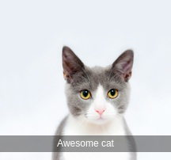

# Watertext - text watermarking library

[](https://doclets.io/pavlov99/watertext/master)

### Features
* Zero dependencies library, works with NodeJS and in the browser.
* 2.3kb minified version.

### Quickstart
1. Install library:
```bash
npm install --save watertext
```
2. Watermark regular image with awesome text:
```javascript
var el = document.getElementsByTagName('img')[0];

// In browser:
el.src = watertext.default(el.src, {text: 'Awesome cat'});
```
| Original image | Watermarked image |
|:---:|:---:|
|  |  |

### Development
The library is tiny and the whole source code is in `index.js` file. It uses ES6 syntax with [AirBnB style-guide](https://github.com/airbnb/javascript). Make sure to `eslint` your code and write jsdoc for every method.

### Deployment
Webpack builds both regular and minified versions to `dist` folder.
```bash
yarn build
```

Publish new version with `npm`:
```bash
npm publish
```

### Watermarking options
All of the parameters except `text` are optional. By default, the watermark is placed at the bottom of the image with 10px margin.

| Name | Type | Default | Description |
|---|---|---|---|
| text | string | '' | Watermark text. |
| textWidth | number | undefined | Width of watermark in pixels. By default watermark uses 100% of the image width if positioned at the top/bottom and 100% of hight if positioned on the left/right. |
| textSize | number | 12 | Watermark text size. |
| textFont | string | 'Sans-serif' | Watermark text font. |
| textColor | string | 'rgb(255, 255, 255)' | Watermark text color. |
| backgroundColor | string | 'rgba(0, 0, 0, 0.4)' | Watermark background color. Default is gray. |
| position | string | 'bottom' | Position of watermark text, one of "top", "left", "right" or "bottom". |
| margin | number | 10 | Margin from the nearest edge. Negative margin positions watermark at the opposite edge. Useful for text orientation control for "left" and "right" positioning. |

### Acknowledgement

* [baivong/watermark](https://github.com/baivong/watermark) library hugely inspired this project. While there are a lot of similarities, this library does not require jQuery to watermark images.
* [brianium/watermarkjs](https://github.com/brianium/watermarkjs) good multi-purpose watermarking library, inspired ES6 adoption and Webpack usage.
* [Cat image](https://www.pexels.com/photo/adorable-animal-animal-photography-blur-259803/) is provided by [pexels](https://www.pexels.com/).
